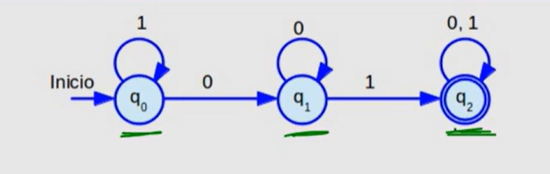

#### Apuntes de clases de Autómatas Finitos, 2024

#### Índice:

1. [Definición formal](#definicion-formal)
    1.1. [Agrupación de estados](#agrupacion-de-estados)
2. [Autómatas finitos deterministas](#automatas-finitos-deterministas)
    2.1. [Qué nos dice un autómata finito determinista?](#que-nos-dice-un-automata-finito-determinista)
    2.2. [Concepto de función de transición extendida](#concepto-de-funcion-de-transicion-extendida)

---

# Definición formal {#definicion-formal}

Esta imagen representa una serie de estados y transiciones entre ellos.

- **q0**: estado inicial donde recibe sus símbolos de entrada.
- **q1**: estado intermedio.
- **q2**: estado de aceptación. Si el autómata llega a este estado, se acepta la cadena de entrada.
- **Transiciones**: son las flechas que unen los estados. Cada transición tiene un símbolo de entrada y un estado de destino.

---

#### Agrupación de estados {#agrupacion-de-estados}

Podemos agrupar en conjuntos los estados de un autómata finito.

- **Q**: conjunto de estados. = {q0, q1, q2}
- **Σ**: alfabeto de entrada. = {0, 1}
- **δ**: función de transición. = { 
        (q0, 1) -> q0, 
        (q0, 0) -> q1, 
        (q1, 0) -> q1, 
        (q1, 1) -> q2, 
        (q2, 0) -> q2, 
        (q2, 1) -> q2 
      }
- **q0**: estado inicial.
- **F**: conjunto de estados de aceptación. = {q2}

Con todo esto, podemos definir un autómata finito **A**.

- **A** = (Q, Σ, δ, q0, F)  
  ó  
- **A** = ({q0, q1, q2}, {0, 1}, δ, q0, {q2})

---

# Autómatas finitos deterministas {#automatas-finitos-deterministas}

Partimos de la definición de autómata finito determinista.

    A = (Q, Σ, δ, q0, F)  
    ó
    A = ({q0, q1, q2}, {0, 1}, δ, q0, {q2})

Una forma de representar la función **δ** es mediante una tabla.

| Edo | δ  | 0  | 1  |
|-----|----|----|----|
|  -> | q0 | q1 | q0 |
|     | q1 | q1 | q2 |
|  * | q2 | q2 | q2 |

    Edo: Estado
    δ: Función de transición
    0, 1: Símbolos de entrada
    -> Estado inicial
    * Estado de aceptación

La tabla se rellena en función de la función de transición **δ**.

    { 
        (q0, 1) -> q0, 
        (q0, 0) -> q1, 
        (q1, 0) -> q1, 
        (q1, 1) -> q2, 
        (q2, 0) -> q2, 
        (q2, 1) -> q2 
    }

---

#### Qué nos dice un autómata finito determinista? {#que-nos-dice-un-automata-finito-determinista}

Esta imagen nos dice que si el autómata recibe una cadena de entrada, la procesa y llega a un estado de aceptación, entonces la cadena de entrada es aceptada.

- **Ejemplo 1**:

        Cadena de entrada: 01
        Estado inicial: q0
        Procesamiento: q0 -> q1 -> q2
        Estado de aceptación: q2
        Cadena aceptada.

- **Ejemplo 2**:

        Cadena de entrada: 100
        Estado inicial: q0
        Procesamiento: q0 -> q1 -> q1
        Estado de aceptación: q2
        Cadena no aceptada.

Ya que se tiene una cadena de entrada que hay que recorrer en base a las funciones **δ** y si se llega a un estado de aceptación, entonces la cadena es aceptada, de lo contrario es rechazada.

---

#### Concepto de función de transición extendida {#concepto-de-funcion-de-transicion-extendida}

La función de transición extendida **δ*** es una función que nos dice cómo se comporta el autómata finito determinista con una cadena de entrada.

        W = 11100001001010
        δ*: (q0, W) = q2

Básicamente, escoge como entradas un estado y una cadena de entrada y devuelve un estado.

Es importante la función de transición extendida porque nos permite llegar a la definición del lenguaje aceptado por un autómata finito determinista.

        L(A) = { W | δ*(q0, W) ∈ F }

**L(A)** se le llama también "Lenguaje Regular" que son aceptados por un autómata finito determinista.

---
